## 1.
`ewfinfo hibernal.E01`
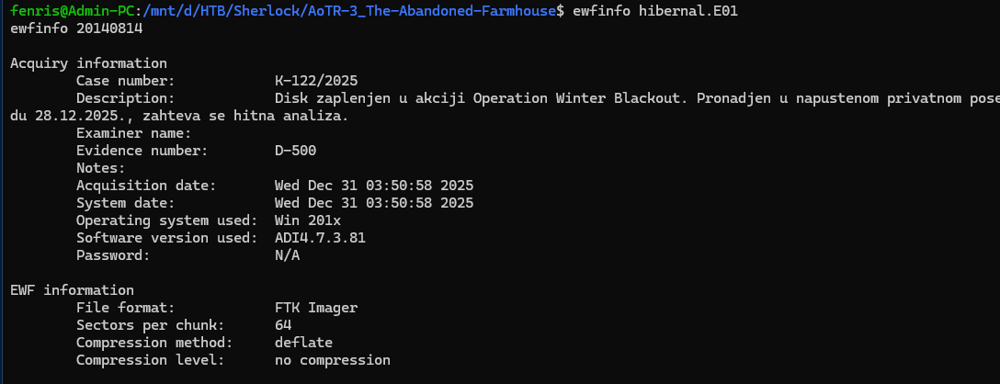
## 2. What encryption type is being used for the targeted partition?
Use ewfexport to extract the raw image file, then check the partitions to identify the LUKS version
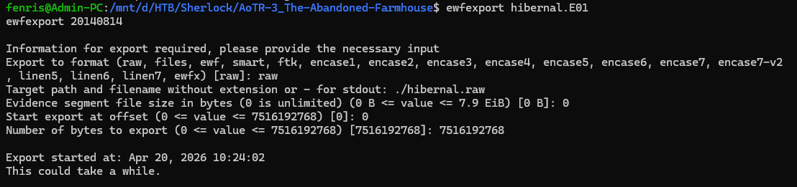
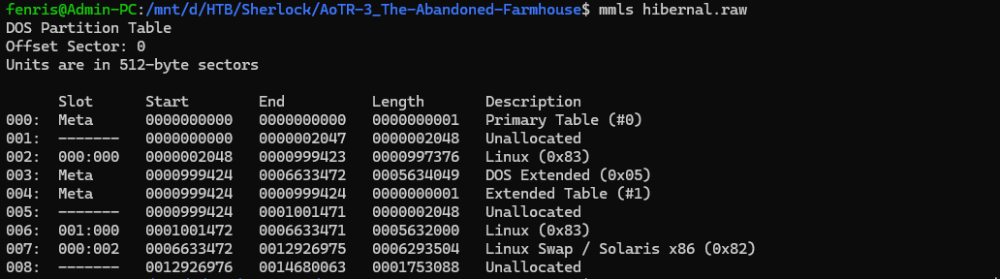
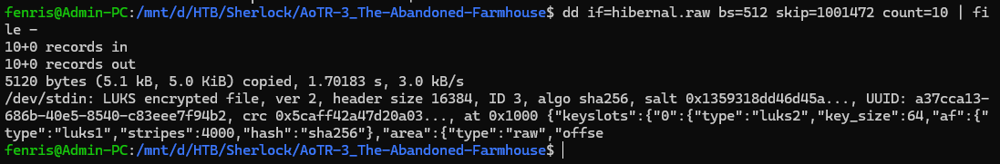
At partition 6, we can see this partition is encrypted with LUKS2 
-> Answer : LUKS2
## 3. What is the AES master key, expressed in hexadecimal?
To obtain the master key, we first need a passphrase to decrypt it, since the master key is stored in the encrypted LUKS2 partition
Examining the remaining partitions, we find partition 7 is Linux swap (virtual memory), which likely contains the passphrase. We proceed to dump partition 7
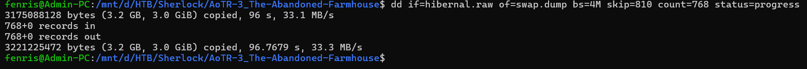
Since LUKS2 uses AES, we use aeskeyfind to locate AES key fragments in the swap file
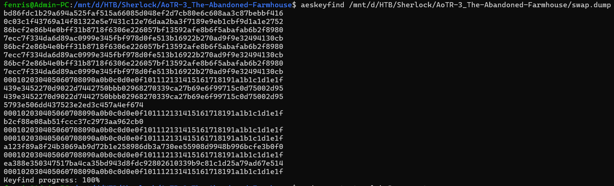
Next, we mount partition 006 from the hibernal.raw file to /dev/loop0
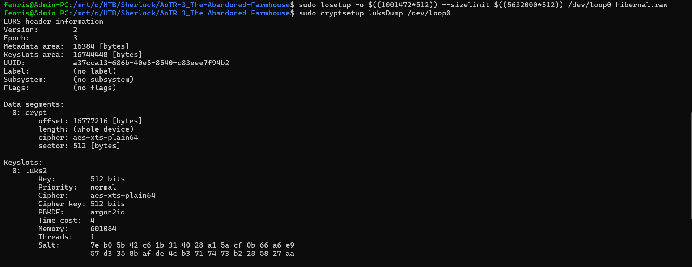
Since the master key is 512-bit, we combine the key fragments and attempt brute force combinations

```
keys=(
"bd86fdc1b29a694a525faf515a66085d048ef2d7cb80e6c608aa3c87bebbf416"
"0c03c1f43769a14f81322e5e7431c12e76daa2ba3f7189e9eb1cbf9d1a1e2752"
"86bcf2e86b4e0bff31b8718f6306e226057bf13592afe8b6f5abafab6b2f8980"
"7ecc7f334da6d89ac0999e345fbf978d0fe513b16922b270ad9f9e32494130cb"
"439e3452270d9022d7442750bbb02968270339ca27b69e6f99715c0d75002d95"
"a123f89a8f24b3069ab9d72b1e258986db3a730ee55908d9948b996bcfe3b0f0"
"ea388e350347517ba4ca35bd943d8fdc92802610339b9c81c1d25a79ad67e514"
)

for k1 in "${keys[@]}"; do
    for k2 in "${keys[@]}"; do
        combined="${k1}${k2}"
        echo -n "Trying: ${combined:0:16}...${combined: -16} -> "
        echo "$combined" | xxd -r -p > /tmp/testkey.bin
        if sudo cryptsetup luksOpen --master-key-file /tmp/testkey.bin /dev/loop0 decrypted_root 2>/dev/null; then
            echo "SUCCESS! Key: $combined"
            break 2
        else
            echo "fail"
        fi
    done
done
```

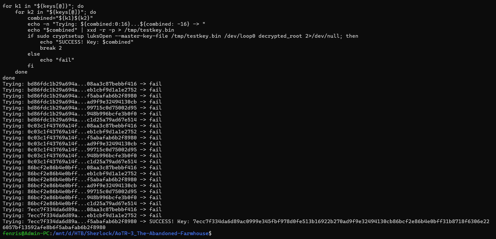
The script tests all combinations of the found key fragments until it successfully unlocks the LUKS container with the correct 512-bit master key.

-> Answer : 7ecc7f334da6d89ac0999e345fbf978d0fe513b16922b270ad9f9e32494130cb86bcf2e86b4e0bff31b8718f6306e226057bf13592afe8b6f5abafab6b2f8980

## 4. What is the IP address of the last machine which connected to SMB share?
Next, we mount the filesystem for analysis
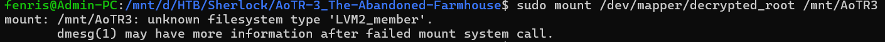
Since /dev/mapper/decrypted_root contains decrypted data but with LVM inside, we need to mount its logical volume
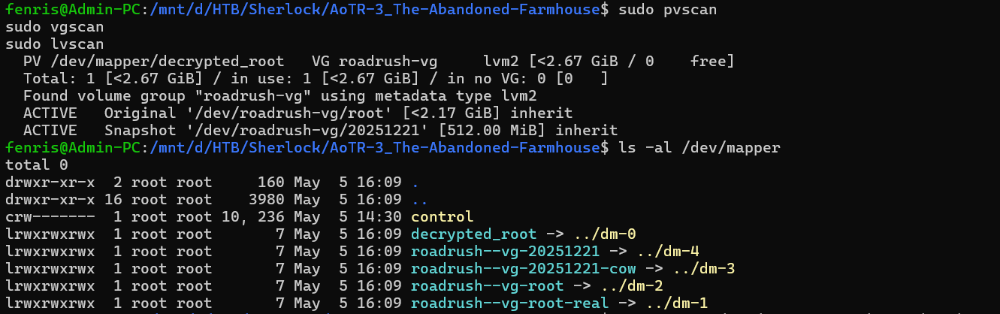
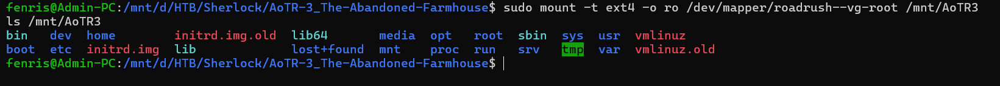
To check which IP connected to SMB, we examine the Samba logs in /var/log/samba
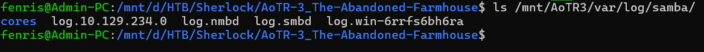
-> Answer : 10.129.234.0

## 5. What is the name of the SMB share which was being used to share documents?
Not completed yet

## 6. What is the total estimated monetary value of the artifacts targeted for theft?
From our analysis, we have a snapshot /dev/roadrush-vg/20251221, which we mount to /mnt/snap
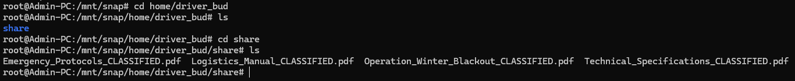
This snapshot contains PDF files with the operation plan that were deleted from the original version. In the file Operation_Winter_Blackout_CLASSIFIED.pdf:
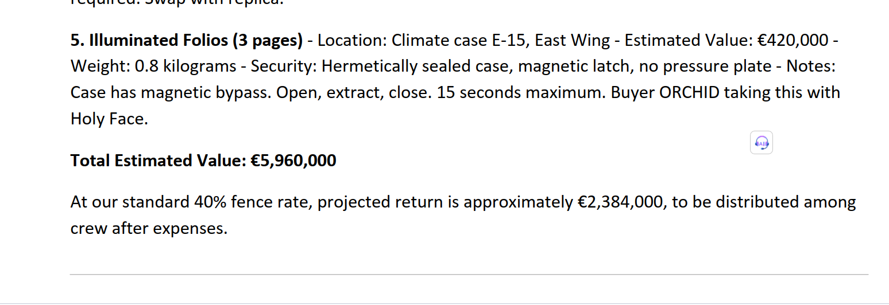
-> Answer : 5960000

## 7. What is the exact model of the drone that was modified for the operation?
Not completed yet

## 8. What codeword is designated to initiate the attack?
In the file Emergency_Protocols_CLASSIFIED.pdf:
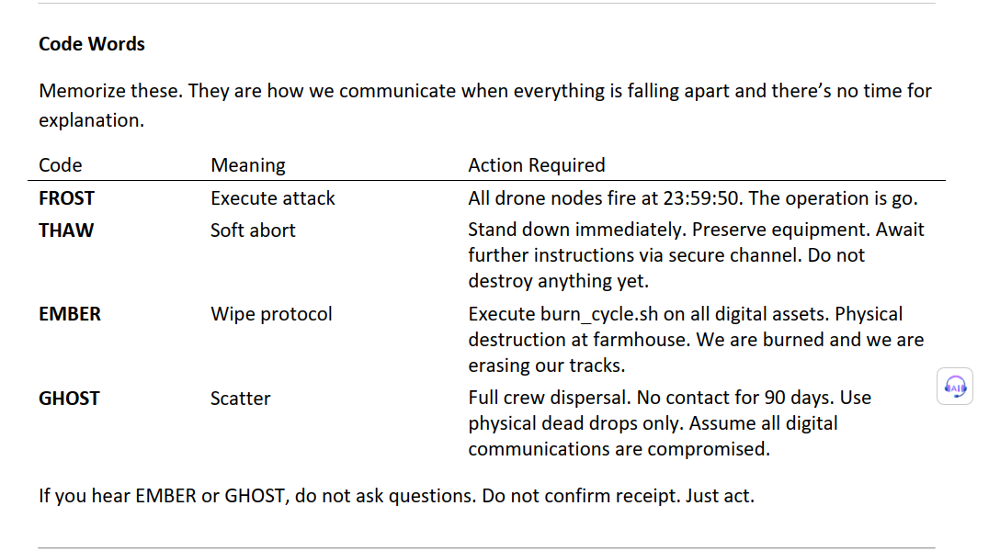
-> Answer : FROST

## 9. At what exact time is the attack scheduled to be executed?
In the file Operation_Winter_Blackout_CLASSIFIED.pdf:
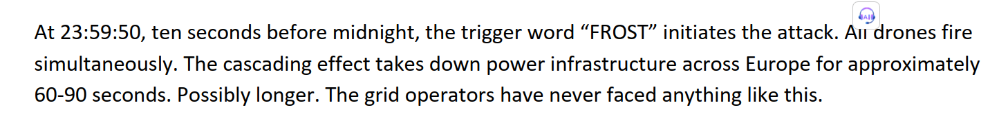
-> Answer : 23:59:50

## 10. In which city will the crew be positioned during the execution of the attack?
-> Answer : Budapest