## 1. Identify the phishing URL that the user clicked on, resulting in credential harvesting.
Vì người dùng mở phising URL nên khả năng nó vẫn còn được lưu trong History.db của trình duyệt , tại vị trí 
C\Users\otello.j\AppData\Local\Google\Chrome\User Data\Default\History
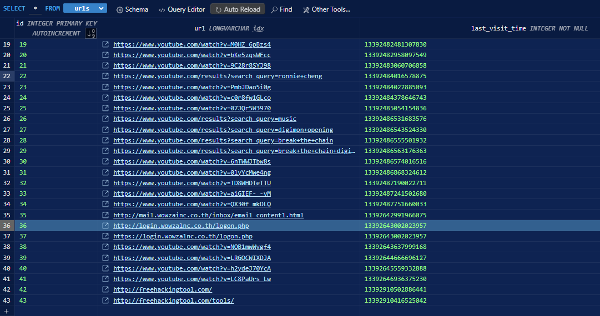
Có thể thấy phishing URL : http://login.wowzalnc.co.th/logon.php đang giả mạo legitmimate domain : wowzainc.co.th
-> Answer : http://login.wowzalnc.co.th/logon.

## 2. When did the threat actor gain access to the victim's computer via RDP for the first time?
Đầu tiên khoanh vùng thời gian, nạn nhân đã mở Phishing URL lúc 13392643002023957 (WebKit timestamp), convert sang UTC là 25 May 2025 at 10:36:42, kết hợp khi access a computer via RDP thì envent log sẽ lưu sự kiện với LogonType 10, dùng EvtxECmd.exe để parse envent log sau đó TimelineExplorer.exe để kiểm tra 
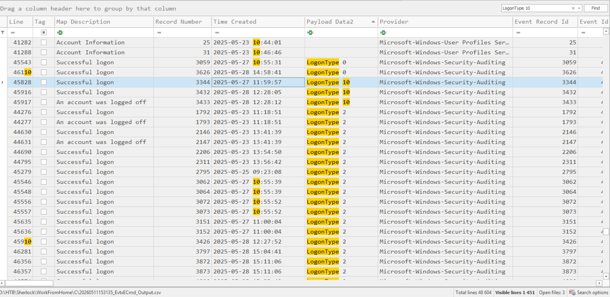
-> Answer : 2025-05-27 11:59:57

## 3. The threat actor accessed several sensitive files on the victim's work-related folder. What is the full path of the PowerPoint presentation file opened by the attacker?
Dùng MFTECmd.exe để parse $MFT 
Kiểm tra danh sách các file có ext : pptx 
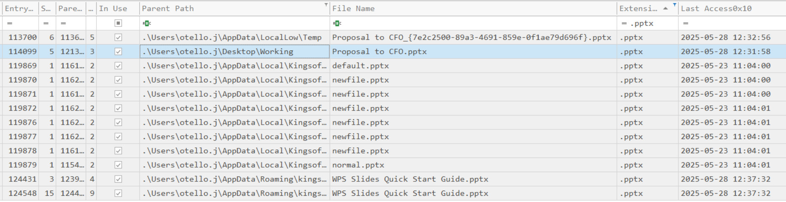
Ở đây file Proposal to CFO.pptx có Last Access0x10 gần nhất với thới điểm attacker access nhất
-> Answer : C:\Users\otello.j\AppData\LocalLow\Temp\Proposal to CFO.pptx

## 4. The threat actor discovered a privilege that allows specific volume-level management operations and could be exploited to get full control over the C drive. What is this special privilege?
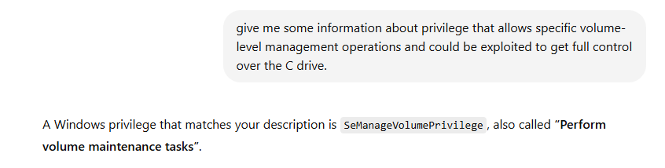
Theo đề cập của ChatGPT SeManageVolumePrivilege chính là privilege phù hợp với mô tả
-> Answer : SeManageVolumePrivilege

## 5. What is the name of the executable downloaded by the threat actor to exploit previously found privilege?
Ở câu 1 chúng ta thấy được attacker đã mở http://freehackingtool.com/tools/ để tìm kiếm công cụ exploit, chuyển sang table downloads để xem file được down từ freehackingtool 
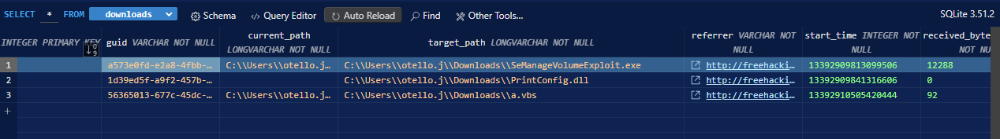
-> Answer : SeManageVolumeExploit.exe

## 6. What is the full URL from where the threat actor tried to download a DLL file?
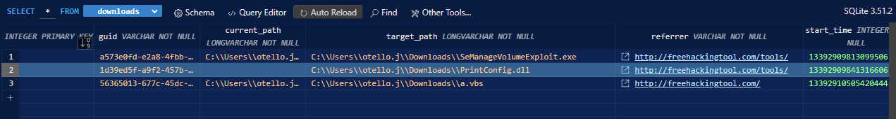
-> Answer : http://freehackingtool.com/tools/PrintConfig.dll

## 7. The malicious DLL file was not successfully downloaded, as the download was interrupted by the safe browsing safety feature. Research Browser forensics and find the description of the interrupt reason that caused the download to be disrupted.
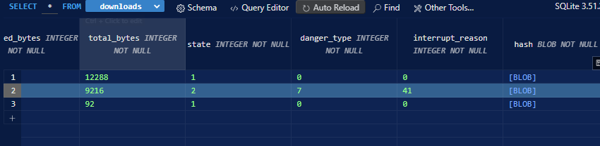
interupt reason 41 , chúng ta có thể kiểm tra ở [link](https://dfir.blog/chrome-values-lookup-tables/)
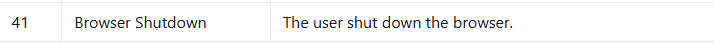
-> Answer : The user shut down the browser

## 8. Since the download was not successful from the browser directly, which LOLBIN did the threat actor use to download this file successfully?
Ở "C\Users\otello.j\AppData\LocalLow\Microsoft\CryptnetUrlCache\MetaData" chứa metadata về các file được tải thông qua Certutil.exe, kiểm tra thử có http://freehackingtool.com/tools/PrintConfig.dll không

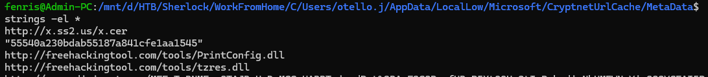
-> Answer : Certutil.exe

## 9. When was the malicious DLL file successfully downloaded using this LOLBIN?
dùng MFTECmd.exe để parse $J xem thời gian file PrintConfig.dll được tạo ra 
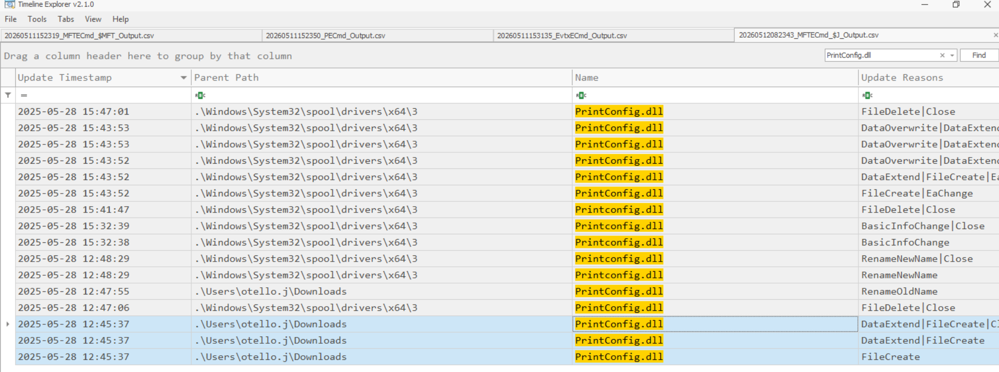
-> Answer : 2025-05-28 12:45:37

## 10. To gain System privileges, the threat actor replaced an existing DLL with the same name. What is the original path of the legitimate DLL?
Ở đây có thể thấy attacker đã xóa file C:\Windows\System32\spool\drivers\x64\3\PrintConfig.dll, sau đó cut file C:\Users\otello.j\Downloads\PrintConfig.dll rồi paste ra tại C:\Windows\System32\spool\drivers\x64\3\
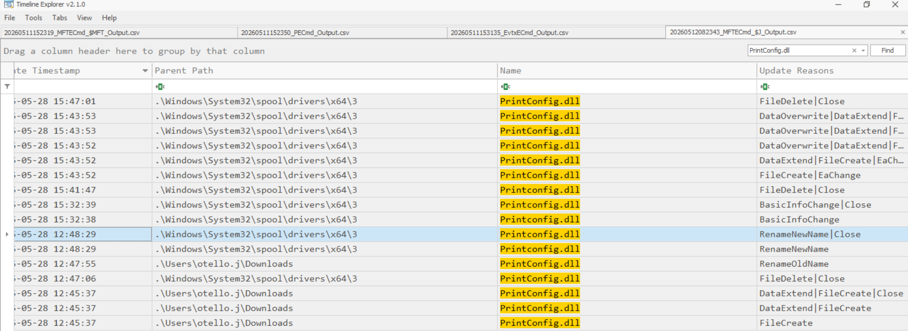
-> Answer : C:\Windows\System32\spool\drivers\x64\3\PrintConfig.dll

## 11. The threat actor removed the legitimate DLL before replacing it with the malicious DLL. When was the legit DLL deleted?
Từ câu trên ta có thể thấy 
-> Answer : 2025-05-28 12:47:06

## 12. When was the malicious DLL detected as malware?
Kiểm tra trong Event Logs với keyword : "Defender"
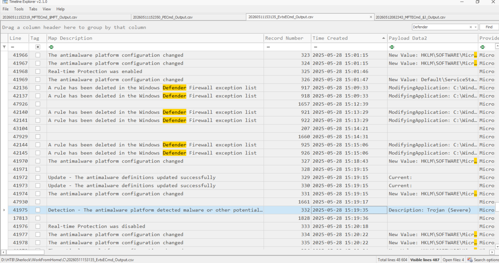
-> Answer 2025-05-28 15:19:35

## 13. The threat actor initiated a Windows component to load this DLL. What is the CLSID of this component?
Tại D:\HTB\Sherlock\WorkFromHome\C\Users\otello.j\AppData\Roaming\Microsoft\Windows\PowerShell\PSReadline\ConsoleHost_history phát hiện thấy trong lịch sử powershell có tạo COM instance với CLSID như dưới
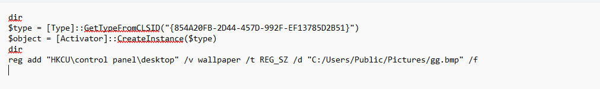
-> Answer : {854A20FB-2D44-457D-992F-EF13785D2B51}

## 14 . What is the name of the service/object associated with this CLSID?
Kiểm tra tại eventlog sự kiện malicious DLL detected as malware bởi window defender
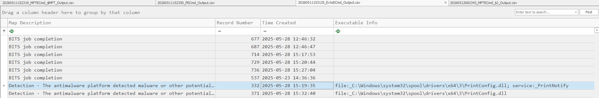
-> Answer : PrintNotify

## 15. What is the SHA1 hash of the malicious DLL file?
log của Windows Defender có lưu SHA-1 của các file mà nó detect malicious để so với threat intelligence 
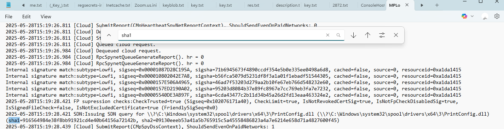
-> Answer : 916564984e38f8bb91921cd4e40b64156a72142b156a72142b

## 16. A Second DLL file was downloaded from the same malicious domain. Where was it downloaded on the filesystem?
Từ câu 8 ta biết được bên file DLL thứ 2 attacker tải về thông qua Certutil.exe là tzress.dll, tiến hành kiểm tra $J để xem parent path chỗ nó tải về
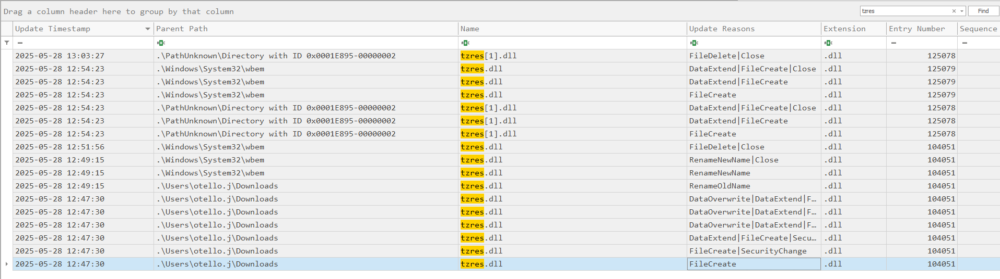
Có thể thấy sau khi được tải về thì file đã được replace tại C:\Windows\System32\wbem
-> Answer : C:\Windows\System32\wbem\tzres.dll

## 17. When was this DLL downloaded on the system?
Từ câu trên ta thấy được
-> Answer : 2025-05-28 12:54:23

## 18. The threat actor downloaded a VBScript for command execution to facilitate the DLL execution of the second malicious DLL. What is the full path of this script after it was moved to a new location?
từ câu 5, ta biết được file VBScript attacker tải về là a.vbs, tiến hành kiểm tra $J để biết được nó được move qua đâu
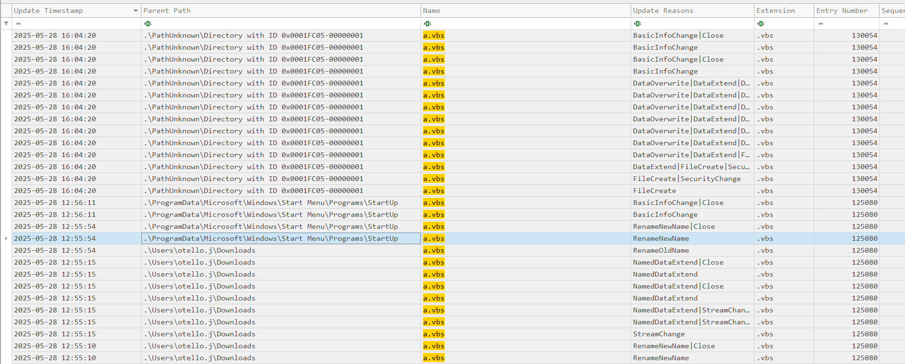
-> Answer : C:\ProgramData\Microsoft\Windows\Start Menu\Programs\StartUp\a.vbs

## 19. What is the full command that the script is configured to execute?
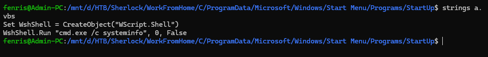
-> Answer : cmd.exe /c systeminf

## 20. The threat actor configured the VBS script to be hidden from the Windows GUI (File Explorer). When was this attribute set on the file?
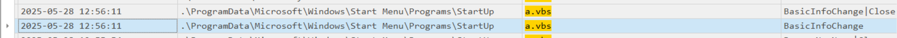
-> Answer : 2025-05-28 12:56:11

## 21. Which process loads the previously identified DLL with this command? The command executed by the VBS script ultimately facilitates loading and execution of the Second malicious DLL, providing persistence and execution capabilities to the attacker.
Vì attacker đã bỏ tzres.dll vào C:\Windows\System32\wbem ( nơi chứa các process của WMI), lệnh của a.vbs gọi systeminfo nó sẽ tương tác với WMI API ( nơi sẽ gọi WmiPrvSE.exe để xử lý provider request, do đó WmiPrvSE.exe sẽ load tzres.dll )
-> Answer : WmiPrvSE.exe

## 22. The threat actor downloaded an image file to change the desktop wallpaper. What is the full path of this file?
Từ câu 13 ta có được
-> Answer : C:/Users/Public/Pictures/gg.bmp

## 23. The threat actor then proceeded to change the desktop wallpaper of the compromised user to the newly downloaded image. Find the time when the wallpaper was altered?
Chúng ta sẽ xem event logs thời điểm powershell chạy lệnh reg add "HKCU\control panel\desktop" /v wallpaper /t REG_SZ /d "C:/Users/Public/Pictures/gg.bmp" /f
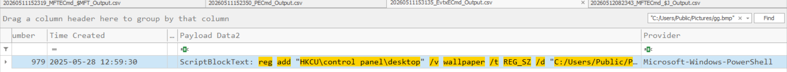
-> Answer : 2025-05-28 12:59:30

## 24. When did the victim user log in to their workstation after the compromise?
Log in trực tiếp vào máy là LogonType = 2, kiểm tra event logs thời điểm user otello.j LogonType=2 sau thời gian máy bị compromise 
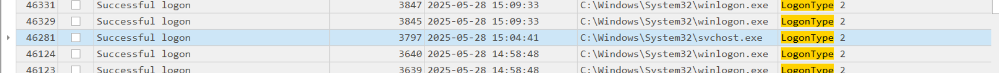
-> Answer : 2025-05-28 15:04:41

## 25. What is the message on the new wallpaper?
Vì trong History.db không thấy ảnh gg.bmp được download bởi Chrome nên khả năng attack vẫn dùng Certutil.exe để download wallpaper, kiểm tra trong C:\Users\otello.j\AppData\LocalLow\Microsoft\CryptnetUrlCache\Metadata xem có tải file gg.bmp không
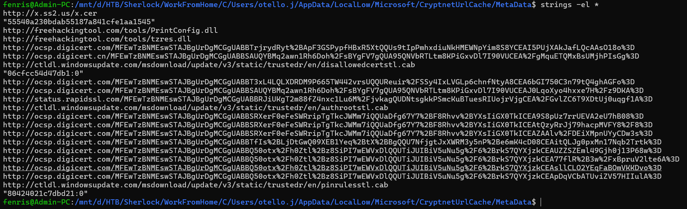
Có 1 khả năng là sau khi exploit thành công user đã download thông qua Certutil.exe dưới quyền SYSTEM
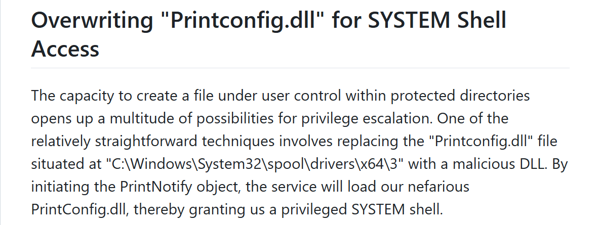
Tiến hành kiểm tra \Windows\System32\config\systemprofile\AppData\LocalLow\Microsoft\CryptnetUrlCache\MetaData
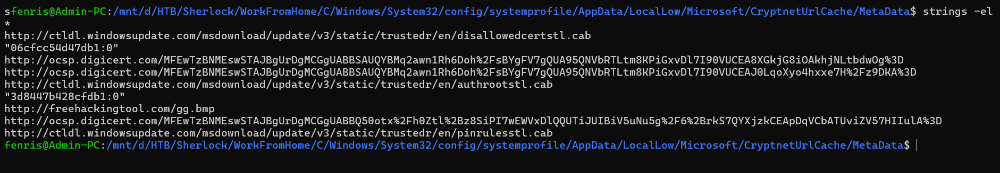
vậy có thể khẳng định attacker đã download gg.bmp qua Certutil.exe dưới quyền SYSTEM sau khi exploit thành công, đọc content để xem message 
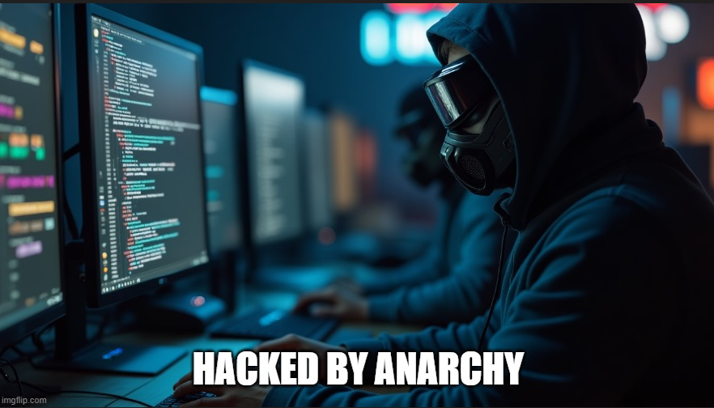
-> Answer : HACKED BY ANARCHY